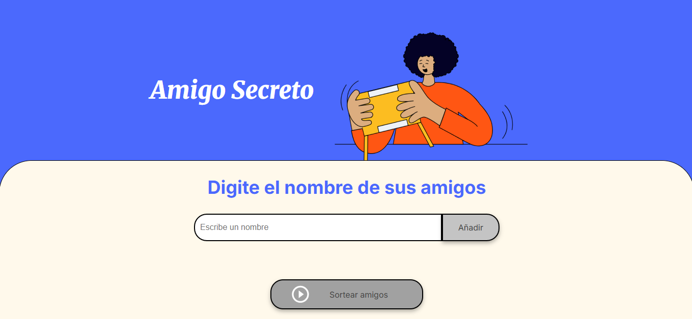
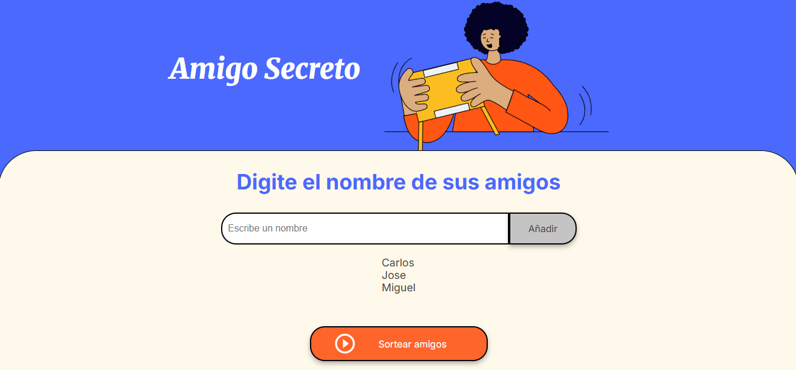
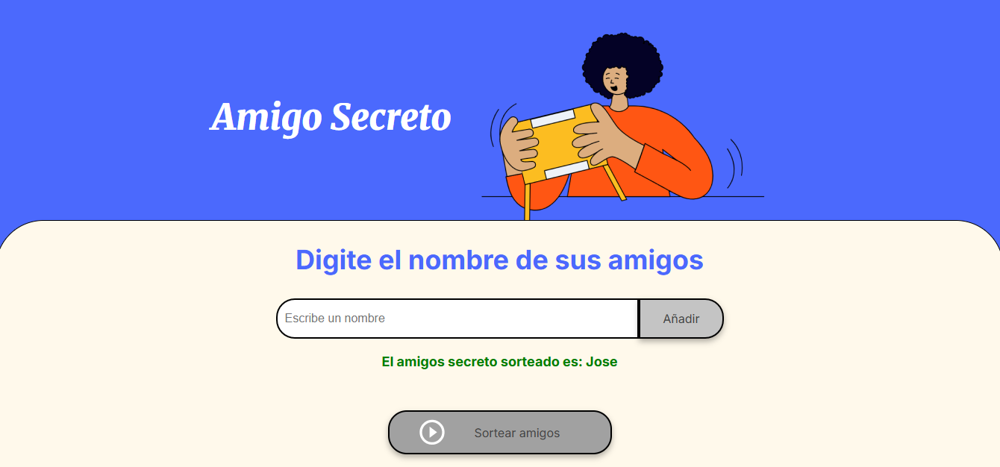

# Desafío Amigo Secreto

¡Bienvenido al Desafío Amigo Secreto! Este proyecto es una aplicación web para organizar sorteos de amigos secretos de forma fácil y divertida.

## Descripción

Esta aplicación te permite crear sorteos entre tus amigos con el objetivo de encontrar a tu amigo secreto, que esperas para probarlo.

## Cómo usar

1. Abre el archivo `index.html` en tu navegador web.
2. Agrega los nombre los amigos que quieras.
3. Dale _Sortear amigos._
4. ¡Disfruta de tu amigo secreto!

## Capturas de pantalla

### Pantalla de Inicio

### Agrega a tus amigos

### Felicidades!. Ya tienes un nuevo amigo secreo

